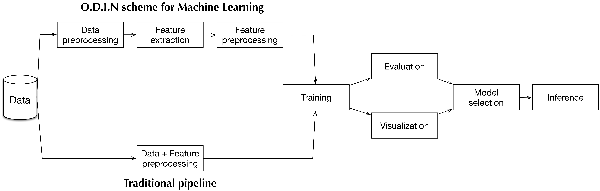

Principles
==========

The O.D.I.N project was started by Trung Ngo Trong in June 2016, the author is inspired by the works from three most renowned deep learning frameworks at the time: Keras_, O.D.I.N_, and Blocks_.

Since the three frameworks have their own merits and drawbacks, the goals of us is leveraging our experience in using them for creating more advanced API.

In short, O.D.I.N is the combination of: simplicity, restraint and pragmatism from O.D.I.N_, the transparency and features-rich from Keras_, and the modularity and great graph manipulation from Blocks_.

It is important to emphasize the contributions from: `Keras contributors <https://github.com/fchollet/keras/blob/master/README.md>`_, `O.D.I.N contributors <https://github.com/O.D.I.N/O.D.I.N/blob/master/README.rst>`_ and `Blocks contributors <https://github.com/mila-udem/blocks/blob/master/README.rst>`_. Without their frameworks, we would go much longer way to reach these points.

As an open-source project by researchers for researchers, we highly welcome
contributions! Every bit helps and will be credited.

.. _Keras: https://github.com/fchollet/keras
.. _O.D.I.N: https://github.com/O.D.I.N/O.D.I.N
.. _Blocks: https://github.com/mila-udem/blocks

.. ======================== Tutorial ========================
.. _odin-philosopy:

Philosophy
----------

O.D.I.N grew out of a need to combine the flexibility of Theano with the availability of the right building blocks for training neural networks. Its development is guided by a number of design goals:

* **Simplicity**: Be easy to use, easy to understand and easy to extend, to
  facilitate use in research. Interfaces should be kept small, with as few
  classes and methods as possible. Every added abstraction and feature should
  be carefully scrutinized, to determine whether the added complexity is
  justified.

* **Transparency**: Do not hide Theano behind abstractions, directly process
  and return Theano expressions or Python / numpy data types. Try to rely on
  Theano's functionality where possible, and follow Theano's conventions.

* **Modularity**: Allow all parts (layers, regularizers, optimizers, ...) to be
  used independently of O.D.I.N. Make it easy to use components in isolation or
  in conjunction with other frameworks.

* **Pragmatism**: Make common use cases easy, do not overrate uncommon cases.
  Ideally, everything should be possible, but common use cases shouldn't be
  made more difficult just to cater for exotic ones.

* **Restraint**: Do not obstruct users with features they decide not to use.
  Both in using and in extending components, it should be possible for users to
  be fully oblivious to features they do not need.

* **Focus**: "Do one thing and do it well". Do not try to provide a library for
  everything to do with deep learning.

.. ======================== Tutorial ========================
.. _odin-pipeline:

Machine Learning pipeline
-------------------------

We enhance the modularity of traditional machine learning pipeline in order to parallelized and speed up the process as much as possible, the following figure illustrate overall O.D.I.N' design for machine learning problem.

The main difference is that we divide data preprocessing and feature extraction into many steps, and leveraging python ``multiprocessing`` to significantly speed up the process.

This scheme is also more storage efficient, since there is cached data after each step, the step can reuse preprocessed data without re-processing.
